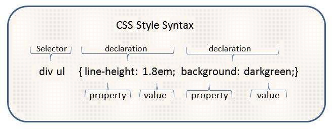

[[Home](README.md)] [[Growth Mindset](growthmindset.md)] [[What is Markdown?](learning_markdown.md)] [[Coder's Computer](coders_computer.md)] [[Revisions in the Cloud](revisions_in_the_cloud.md)] [[Getting Started With HTML]](gettingstartedwithhtml.md) [[CSS Beginner Basics](css_basics.md)] [[Dynamic Web Pages With Javascript](dynamic_webpages_with_javascript.md)]
# CSS Beginner Basics

## What is CSS?
CSS stands for Cascading Style Sheets.  While HTML is known as the skeleton or structure of a page, CSS is the clothing or style that gives the page color and design.

## How do you style HTML with CSS?
While it is possible to style HTML within HTML code it is best practice to style HTML in a separate CSS document.  The CSS document is then linked within the head section of the HTML category.  Here are a few steps to get started with styling HTML:
1. Create a new external .css file using your code editor.
2. Link the .css file within the Head tag of your html file &lt;link rel="stylesheet" href="styles.css"&gt;
3. Next, you will need to add a selector to the html element that needs to be styled.  Think of the word "selector" being a way for the developer to "select" which HTML element should be styled.  There are a number of selectors and they are heirarchal, meaning when two are used one overrides the other.  Here is a [link](https://www.w3schools.com/css/css_examples.asp) that gives more information about CSS selectors and another [link](https://www.w3schools.com/css/css_specificity.asp) that describes hierarchal specificity.  use a class or id tag.  Alternately you can use the element name itself (such as p).  

Example:  &lt; div class= "main" &gt;.  

4. Next, navigate to the external .css file.  Add the selector that you wish to style with curly brackets { } and the designated style change (called a declaration).  See the example below for help. 

5. The last step is to preview the changes in your web browser.

