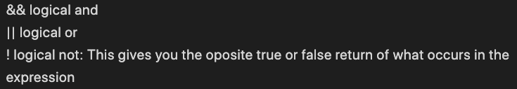

[[Home](README.md)] [[Growth Mindset](growthmindset.md)] [[What is Markdown?](learning_markdown.md)] [[Coder's Computer](coders_computer.md)] [[Revisions in the Cloud](revisions_in_the_cloud.md)] [[Getting Started With HTML]](gettingstartedwithhtml.md) [[CSS Beginner Basics](css_basics.md)] [[Dynamic Web Pages With Javascript](dynamic_webpages_with_javascript.md)] [[Computer Architecture and Logic](computer_architecture_and_logic.md)] [[Programming with JS](programming_with_javascript.md)] [[Operators and Loops](operators_and_loops.md)] 

# Operators and Loops 
(p. 150-151, 156-157, 170-172, 176 of Duckett Text)

## Using Comparison Operators
A person can evaluate two variables with a comparison operator.  Here is a list of some of the comparison operators:
- == equal to
- === strict equal to (takes into account the data type such as a string.
- != not equal to
- !== strict not equal ot (takes into account the data type)
- (>) greater than
- (<) less than
- (<=) less than or equal to
- (>=) greter than or equal to

Usually a condition will have at least two operands and one comparison operator.  These conditions will be closed with parenthesis.  Each expression after evaluated becomes a variable.  
## Using Logical Operators
To compare more than one expression, a person might use a logical operator.  A logical operator returns a boolean value of true or false.  Here is a list of some of the logical operators:
 
 
> 

## Loops
When executed, a loop will continue if the conditions are true.  If the loop is stopped with a break or returns false it will end. The three types of loops are for, while, and do while.  Below is a definition of each.  This [website](https://developer.mozilla.org/en-US/docs/Web/JavaScript/Guide/Loops_and_iteration) goes into more detail about these loops.

## Condition Counter in For Loops
A for loop counter is a condition is made up of three stratements that will instruct the code to continue until the conditions are false or there is a break.  The condition is made up of three statements.  See the labeled example below.

for (var i = 20; i >= 10; i--)

- **for** = keyword
- **initialization** = var i = 20
- **condition** = i>=10
- **update** = i-- (every time the loop runs it subtracts one.  This is the decrement operator.  The opposite of this is the increment operator ++)

Source: Duckett, J. (2014). JavaScript &amp; jQuery : Interactive front-end web development. Indianapolis, IN: John Wiley &amp; Sons.